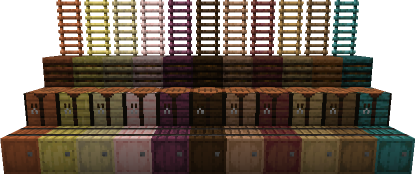

# 🔥 FyreVariants

**FyreVariants** is a NeoForge mod that adds variants to existing Minecraft blocks ✨  
Everything stays vanilla friendly. Just more choices for people who love matching wood types.

> 💗 This is my **first Minecraft mod**! I’m still learning and experimenting, so things may grow and change over time 🌱

---

## 🧱 Added Variants

**Wood Types:**  
Acacia · Bamboo · Birch · Cherry · Crimson · Dark Oak · Jungle · Mangrove · Oak · Spruce · Warped

**Minecart Types:**  
Iron · Copper · Gold · Diamond · Netherite

**Blocks & Items:**
- 🪵 **Barrels**
- 📦 **Chests**
- 🌿 **Composters**
- 🛠️ **Crafting Tables**
- 🪜 **Ladders**
- 🚂 **Rails**
- 🔥 **Campfires**
- 🐝 **Beehives**
- 🚋 **Minecarts**

Each block is available in the wood types listed above 💗

---

## 💬 Community & Support

Have feedback, ideas, or found a bug?  
Come hang out on Discord. Would love to hear from you! 🌸

👉 **Discord:** https://discord.gg/ujYwj8RuT6

---

## ⚙️ Compatibility

- Built for **NeoForge 1.21.1**
- No plans to port to other Minecraft versions (for now 💭)

Thanks for checking out **FyreVariants**! 🌸
